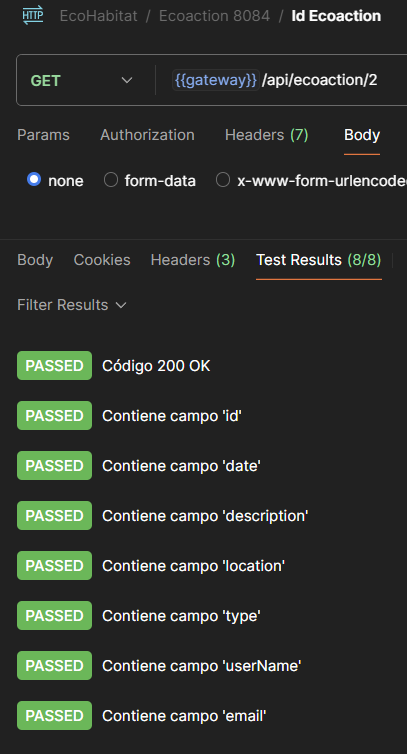
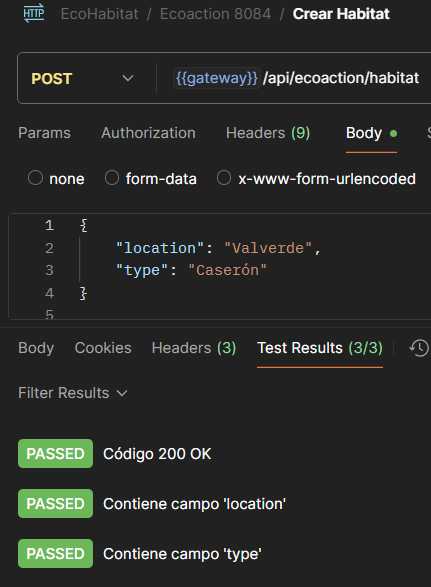
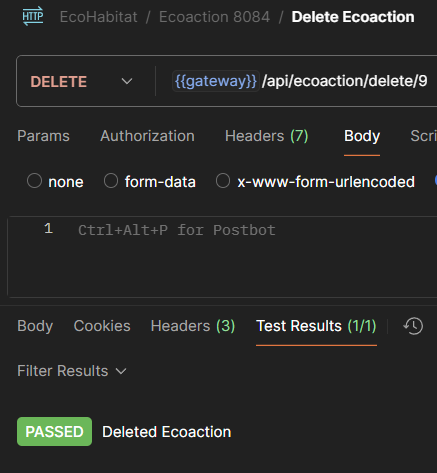

  

# EcoHabitats 

_EcoHabitats_ es una plataforma distribuida orientada a la gestión eficiente de viviendas, desarrollada bajo una arquitectura de microservicios utilizando Java 21, Spring Boot 3.4.3, Eureka y Feign. Este proyecto responde a la finalización de formación IronHack.

---

## Enlaces de interés

### Repositorios del proyecto

- [user-service](https://github.com/ecoHabitat-final-project/user-service) – Gestión de usuarios
- [habitat-service](https://github.com/ecoHabitat-final-project/habitat-service) – Gestión de viviendas
- [ecoaction-service](https://github.com/ecoHabitat-final-project/ecoaction-service) – Registro de mejoras ecológicas en el hábitat (hogar)
- [gateway-server](https://github.com/ecoHabitat-final-project/gateway-server) – Gateway API para enrutar peticiones
- [discovery-server](https://github.com/ecoHabitat-final-project/discovery-server) – Eureka Server (registro de microservicios)

### Gestión del proyecto

- [Trello - EcoHabitats](https://trello.com/b/oPsZsgzm/ecohabitats) – Planificación, seguimiento y organización de tareas

 ### Presentación del proyecto
 - [Presentación](https://) – Explicación con slides

##  Objetivo del Proyecto

Construir un sistema escalable mediante el uso de microservicios ApiREST que permita:

- Registrar usuarios (user).
- Registrar viviendas (habitats).
- Asociar acciones ecológicas realizadas en cada una.
- Consultar catálogos ecológicos por vivienda.
- Facilitar la comunicación entre servicios mediante **Eureka** y **OpenFeign**.
- Gestionar la infraestructura de manera desacoplada con **Spring Cloud Gateway**.

---

##  Arquitectura

Este proyecto se compone de **cuatro microservicios**:

| Servicio               | Puerto | Descripción                                                                 |
|------------------------|--------|-----------------------------------------------------------------------------|
| `gateway-service`      | 8080   | API Gateway para unificar el acceso a todos los 
| `discovery-service`    | 8081   | Servidor Eureka para el descubrimiento de servicios                         |
| `user-service`         | 8082   | Gestión de usuarios                                                         |
| `habitat-service`      | 8083   | Gestión de viviendas                                                        |
| `ecoaction-service`    | 8084   | Gestión de acciones ecológicas vinculadas a una vivienda  (catálogo)                 |
                |

---

##  Tecnologías y herramientas utilizadas

- Java 21
- Spring Boot 3.4.3
- Spring Data JPA
- Spring Cloud Eureka
- OpenFeign
- Spring Cloud Gateway
- MySQL 8.x
- Lombok
- Maven Multi-module
- Git + GitHub
- Postman (para pruebas de endpoints)
- UML (Diagramas de clases y arquitectura)

---

##  Entidades Principales

  

- `User`: contiene datos básicos como nombre, email y ciudad.
- `Habitat`: representa una vivienda, asociada a un usuario.
- `EcoAction`: registra una mejora ecológica puntual en una vivienda (como instalación solar, aislamiento térmico, etc.).

---

##  Comunicación entre servicios

La comunicación entre microservicios se realiza a través de **Feign Clients**, utilizando `@FeignClient` y resolviendo las rutas dinámicamente mediante el servidor de descubrimiento Eureka.

---

##  Estado actual del desarrollo

✔️ Eureka funcionando correctamente  
✔️ Comunicación entre servicios validada  
✔️ Catálogo ecológico funcional  
✔️ Implementación de Feign en `ecoaction-service`  
✔️ Arquitectura modular y documentación clara  
✔️ Gateway configurado   
✔️ Test unitarios, mock, mockMVC y Postman

---

## Futuras mejoras

- Incorporar autenticación básica para usuarios.
- Incorporar vlidaciones de datos.
- Añadir acciones ecológicas personalizadas.
- Exponer métricas de eficiencia ecológica.
- Crear dashboards con datos estadísticos.
- Implementar notificaciones al usuario.

---

## Cómo ejecutar los servicios -Aún no disponible

1. Iniciar `discovery-service` (`localhost:8081`)
2. (Opcional) Lanzar `gateway-service` en el puerto 8080
3. Lanzar `user-service`, `habitat-service` y `ecoaction-service`
4. Consultar endpoints desde Postman

---

## Ejemplos Postman
### 📸 Pruebas funcionales con Postman

Las siguientes capturas ilustran la correcta ejecución de las operaciones principales del microservicio `ecoaction-service` utilizando Postman:

| Operación                         | Descripción                                      | Captura                                                                 |
|----------------------------------|--------------------------------------------------|-------------------------------------------------------------------------|
| `POST /api/ecoaction`            | Crear una nueva ecoacción                        |                       |
| `GET /api/ecoaction/{id}`        | Consultar ecoacción con datos enriquecidos       |                            |
| `POST /api/ecoaction/habitat`    | Registrar nuevo hábitat desde el catálogo        |                 |
| `DELETE /api/ecoaction/delete/9` | Eliminar ecoacción                               |                      |

## Autor

**Daniel Moltó**  
Desarrollador Backend | Estudiante UNED  
Formación en Spring Boot & Microservicios by IronHack 
GitHub: [github.com/peterparker79](https://github.com/peterParker79)

---

> “Desarrollar conciencia ecológica no es sólo cuestión de hábitos, sino de software que los promueva.”
